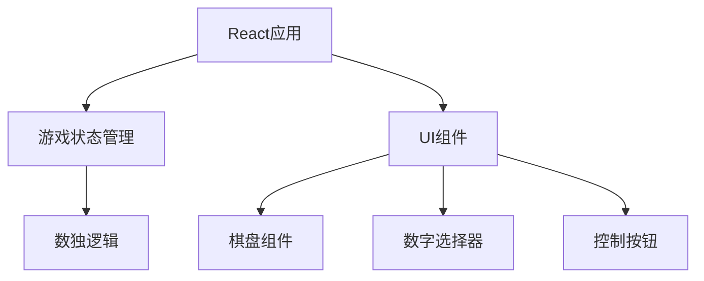

## 1. 架构设计
这是一个纯前端的数独游戏应用，使用React + TypeScript + Tailwind CSS构建。



## 2. 技术描述
- 前端：React@18 + TypeScript + Tailwind CSS@3 + Vite
- 初始化工具：vite-init
- 后端：无需后端
- 数据库：无需数据库

## 3. 路由定义
| 路由 | 用途 |
|------|------|
| / | 数独游戏主页面 |

## 4. API定义
本项目不需要后端API，所有逻辑在前端实现。

## 5. 服务器架构图
本项目不需要后端服务器。

## 6. 数据模型
本项目不需要数据库。数独数据使用以下数据结构：

```typescript
interface Cell {
  value: number | null;
  fixed: boolean;
  error: boolean;
}

type Board = Cell[][];

type Difficulty = 'easy' | 'medium' | 'hard';
```
