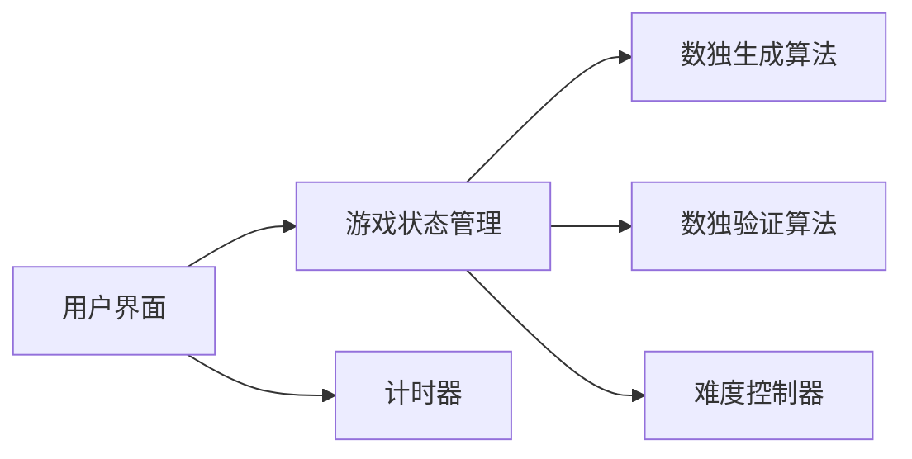

## 1. Architecture Design
单页面应用架构，前端使用React实现，所有逻辑都在浏览器端完成，无需后端服务。

## 2. Technology Description
- **Frontend**: React@18 + TypeScript + tailwindcss@3 + vite
- **Initialization Tool**: vite-init
- **Backend**: None (纯前端应用)
- **Database**: None (无需数据库)

## 3. Route Definitions
| Route | Purpose |
|-------|---------|
| / | 游戏主页面 |

## 4. API Definitions
无需后端API，所有功能在前端实现。

## 5. Server Architecture Diagram
不适用，无后端服务。

## 6. Data Model
### 6.1 Data Model Definition
不适用，无数据库。

### 6.2 Data Definition Language
不适用。
