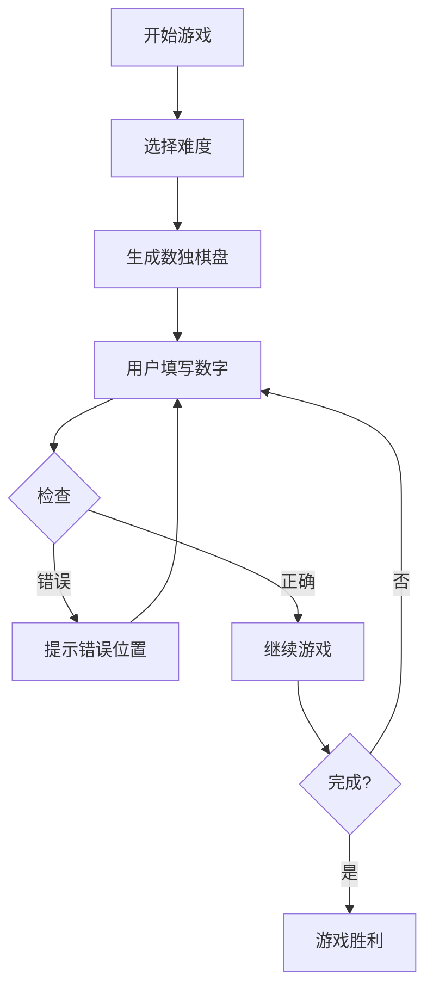

## 1. 产品概述
一款苹果iOS风格的数独游戏，提供简单、中等、复杂三种难度，让用户享受经典的数独体验。
- 主要功能：数独游戏、难度选择、游戏提示、检查功能
- 目标用户：数独爱好者和休闲游戏玩家

## 2. 核心功能

### 2.1 用户角色
| 角色 | 注册方式 | 核心权限 |
|------|---------|---------|
| 普通用户 | 无需注册 | 完整使用游戏所有功能 |

### 2.2 功能模块
1. **游戏页面**：数独棋盘、数字选择、操作按钮
2. **设置页面**：难度选择、主题切换

### 2.3 页面详情
| 页面名称 | 模块名称 | 功能描述 |
|---------|---------|---------|
| 游戏页面 | 数独棋盘 | 9×9网格，显示可编辑和固定数字 |
| 游戏页面 | 数字选择器 | 1-9数字按钮，用于输入数字 |
| 游戏页面 | 操作按钮 | 检查、提示、重置、新游戏 |
| 设置页面 | 难度选择 | 简单、中等、复杂三种难度选项 |

## 3. 核心流程
用户打开应用 → 选择难度 → 开始游戏 → 填写数字 → 检查解答 → 完成游戏

## 4. 用户界面设计
### 4.1 设计风格
- 主色调：iOS风格的蓝色系（#007AFF、#5856D6）
- 次要色：浅灰色背景，白色卡片
- 按钮风格：圆角矩形，点击效果采用iOS标志性的弹性动画
- 字体：使用系统字体，清晰易读
- 布局风格：卡片式布局，留白充足
- 图标：简洁的线性图标

### 4.2 页面设计概述
| 页面名称 | 模块名称 | UI元素 |
|---------|---------|-------|
| 游戏页面 | 数独棋盘 | 9×9网格，深色边框区分3×3区块，固定数字和可编辑数字区分明显，选中数字高亮显示 |
| 游戏页面 | 数字选择器 | 底部横向排列，大尺寸数字按钮，iOS风格圆角设计 |
| 游戏页面 | 操作按钮 | 顶部导航栏，检查、提示、重置、新游戏按钮，清晰的图标和文字 |
| 设置页面 | 难度选择 | 分段控制选择器，iOS原生风格 |

### 4.3 响应性
- 桌面端优先，移动端自适应
- 触控优化，按钮尺寸适合点击

### 4.4 3D场景指引
本项目不需要3D场景。
