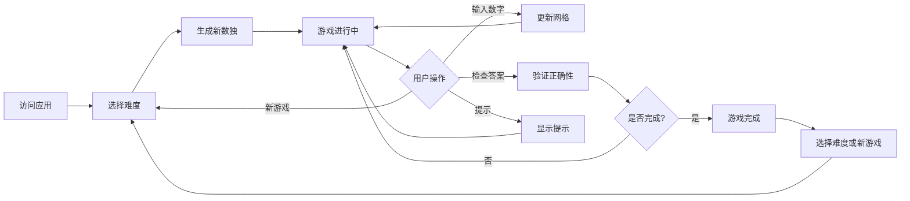

## 1. Product Overview
一款优雅的iOS风格数独游戏应用，支持简单、中等、复杂三种难度级别，提供流畅的游戏体验和精美的用户界面。
- 解决用户在休闲时间进行逻辑思维训练的需求，提供不同难度级别的数独挑战
- 目标市场为喜欢益智游戏的用户群体，打造高品质的单页数独应用

## 2. Core Features

### 2.1 User Roles
无需用户注册，所有功能对所有访问者开放。

### 2.2 Feature Module
1. **游戏主页面**：数独网格、数字键盘、功能按钮
2. **难度选择**：简单、中等、复杂三种难度切换
3. **游戏控制**：新游戏、检查答案、提示功能

### 2.3 Page Details
| Page Name | Module Name | Feature description |
|-----------|-------------|---------------------|
| 游戏主页面 | 数独网格 | 9x9网格显示，高亮选中单元格，高亮相同数字，错误提示 |
| 游戏主页面 | 数字键盘 | 1-9数字按钮，支持点击输入和清除功能 |
| 游戏主页面 | 功能区 | 难度选择器、新游戏按钮、检查按钮、提示按钮 |
| 游戏主页面 | 计时器 | 记录游戏时间 |

## 3. Core Process
用户访问应用 → 选择难度 → 开始游戏 → 输入数字解题 → 检查答案/获取提示 → 完成游戏

## 4. User Interface Design
### 4.1 Design Style
- **Primary colors**: iOS风格 - 白色背景，系统蓝(#007AFF)作为主色，浅灰(#F2F2F7)作为辅助色
- **Secondary colors**: 系统红(#FF3B30)用于错误提示，系统绿(#34C759)用于正确提示
- **Button style**: 圆角矩形，轻微阴影，支持悬停和点击反馈
- **Font**: -apple-system, SF Pro Text, system fonts
- **Layout style**: 居中卡片式布局，清晰的视觉层次
- **Icon style**: 简洁的iOS风格图标

### 4.2 Page Design Overview
| Page Name | Module Name | UI Elements |
|-----------|-------------|-------------|
| 游戏主页面 | 数独网格 | 9x9网格，3x3区块分隔，选中高亮，错误红色边框 |
| 游戏主页面 | 数字键盘 | 圆形数字按钮，点击反馈动画 |
| 游戏主页面 | 功能区 | 分段控制器选择难度，系统风格按钮 |
| 游戏主页面 | 计时器 | 简洁的时间显示 |

### 4.3 Responsiveness
移动优先设计，适配iPhone和iPad等iOS设备，同时支持桌面浏览器访问。

### 4.4 3D Scene Guidance
不适用3D场景。
